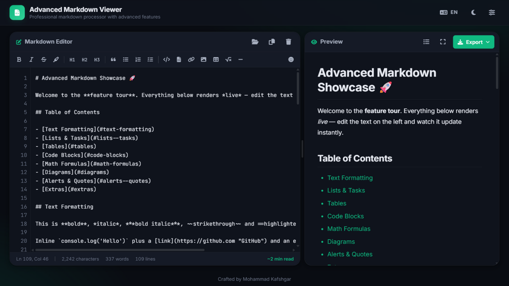
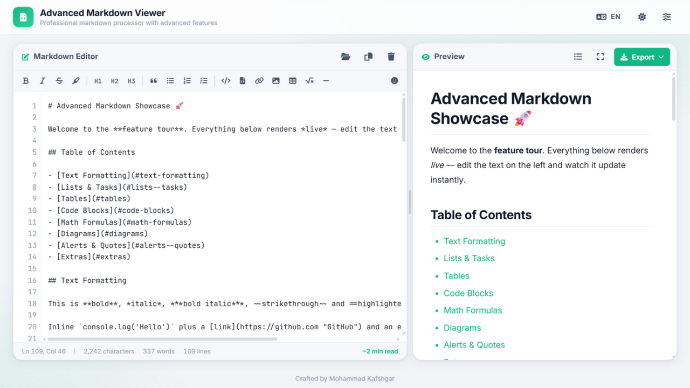

<h1 align="center">📝 Advanced Markdown Viewer</h1>

<p align="center">
  <strong>A professional, feature-rich Markdown editor &amp; viewer with live preview, KaTeX math, Mermaid diagrams, full RTL/Persian support and standalone HTML export.</strong>
  <br>Built with vanilla JavaScript — no frameworks, no build step.
</p>

<p align="center">
  <a href="https://mohammadkmd.github.io/advanced-markdown-viewer/"></a>
  <a href="LICENSE"></a>
  
  
  <a href="https://github.com/mohammadkmd/advanced-markdown-viewer/issues"></a>
</p>

<p align="center">
  
  &nbsp;
  
</p>

---

## ✨ Features

### Editor
- **Live Preview** — debounced instant rendering as you type
- **Formatting Toolbar** — bold, italic, strikethrough, highlight, headings, lists, task lists, code, links, images, tables, math, dividers
- **Smart Keys** — `Tab`/`Shift+Tab` indent, automatic list continuation on `Enter` (empty item exits the list), `Ctrl+B` / `Ctrl+I` / `Ctrl+K` shortcuts
- **Emoji Picker** — search and insert from the full GitHub gemoji set (~1,900 shortcodes)
- **Editor Metrics** — characters / words / lines, cursor position and estimated reading time
- **Bidirectional Scroll Sync** — editor and preview stay glued, without fighting your anchor jumps
- **Drag & Drop** — drop a `.md` / `.markdown` / `.txt` file anywhere in the window
- **Auto-save** — content and settings persist in `localStorage`

### Markdown Rendering
- ✅ GitHub Flavored Markdown (tables, task lists, strikethrough, autolinks)
- ✅ **KaTeX math** — inline `$E = mc^2$` and display `$$...$$`
- ✅ **Multi-format diagrams** — Mermaid (local), PlantUML and GraphViz/dot (image services), emitted by LLMs in different flavors; unreachable services fall back to the original code block
- ✅ **GitHub-style alerts** — `> [!NOTE]`, `[!TIP]`, `[!IMPORTANT]`, `[!WARNING]`, `[!CAUTION]`
- ✅ **Footnotes** — `[^1]` references with a generated footnote section
- ✅ **Highlight** — `==marked text==`
- ✅ Emoji shortcodes (`:rocket:` → 🚀) with the complete gemoji database
- ✅ Code blocks with syntax highlighting (highlight.js), line numbers, language badge and copy button
- ✅ Heading anchors with unique slugs + clickable outline
- ✅ Image figures with lightbox zoom
- ✅ `<details>`/HTML5 elements and `<kbd>`, `<mark>`, `<abbr>` styling
- 🔒 **XSS-safe** — all rendered HTML passes through DOMPurify

### Internationalization & RTL
- 🌐 English / Persian UI with instant switching
- 🔄 Per-block automatic direction (`dir="auto"`) — mixed Persian/English paragraphs always flow correctly
- 🧭 RTL text mode for the editor, RTL code-comment mode, logical CSS properties throughout
- 🔢 Locale-aware numbers (`fa-IR` / `en-US`)

### UI / UX
- 🌙 Dark & light themes (follows system preference on first visit)
- 🎨 Six accent colors (indigo, violet, sky, emerald, amber, rose)
- 🪟 Resizable split panes with a draggable divider (double-click to reset)
- 📑 Outline slide-over panel with active-section highlighting
- 🖥️ Real fullscreen preview (Fullscreen API)
- 📱 Fully responsive — mobile gets Write/Preview tabs
- 🐨 Focus-visible states, `prefers-reduced-motion` and high-contrast support

### Print / PDF Engineering
- **Printing always produces a light document** — from the dark theme the app temporarily switches to light (syntax highlighting and Mermaid diagrams re-rendered), prints, then switches back
- Blocks (code, tables, quotes, alerts, diagrams, math) never get sliced across pages
- Headings carry `break-after: avoid`; paragraphs use widows/orphans control
- Code blocks longer than one page are **chunked with *(continued)* markers** — no line is ever lost
- Code wraps on paper instead of clipping; long tables repeat their header row
- `@page` A4 margins

### Export
- 📄 **Standalone HTML** — theme, RTL, KaTeX and Mermaid baked into one file
- 📝 **Markdown download** and **Copy HTML** to clipboard
- 🖨️ **Print / Save as PDF**

## 🚀 Live Demo

Hosted on GitHub Pages:

> **https://mohammadkmd.github.io/advanced-markdown-viewer/**

## ⌨️ Keyboard Shortcuts

| Shortcut | Action |
|----------|--------|
| `Ctrl/Cmd + S` | Download as HTML |
| `Ctrl/Cmd + O` | Open file |
| `Ctrl/Cmd + B` | Bold |
| `Ctrl/Cmd + I` | Italic |
| `Ctrl/Cmd + K` | Link |
| `F11` | Toggle fullscreen preview |
| `Escape` | Close popover / modal / outline |

## 💻 Run Locally

No build step — it's plain HTML/JS:

```bash
# option 1: just open it
open index.html

# option 2: serve it locally
python tools/dev-server.py 8437
# → http://127.0.0.1:8437
```

External libraries load from CDN (marked, highlight.js, DOMPurify, KaTeX, Mermaid, Font Awesome, Google Fonts). Math and diagrams are only fetched when used. A sample showcase document lives at [`tools/test-document.md`](tools/test-document.md) — drop it into the window to see every feature.

## 📁 Project Structure

```
advanced-markdown-viewer/
├── index.html              # App shell
├── styles.css              # Import hub + global overrides (print, a11y)
├── lang.js                 # i18n system (en/fa)
├── .nojekyll               # Skip Jekyll on GitHub Pages
├── docs/                   # Screenshots & publishing guide
├── css/
│   ├── base.css            # Design tokens, themes, accents, reset
│   ├── layout.css          # App shell, split panes, responsive
│   ├── components.css      # Buttons, toolbar, popovers, modals, toasts
│   ├── markdown.css        # Preview content styles (RTL & print aware)
│   └── animations.css      # Keyframes
├── js/
│   ├── config.js           # App state, constants, sample documents
│   ├── utils.js            # Helpers (escape, slug, storage, download…)
│   ├── emoji-data.js       # Generated gemoji database (~1,900 shortcodes)
│   ├── emoji.js            # Fast single-pass shortcode processor
│   ├── toast.js            # Toast notifications
│   ├── markdown-ext.js     # marked extensions (==mark==, footnotes)
│   ├── renderer.js         # Sanitized rendering pipeline + custom renderers
│   ├── mermaid.js          # Lazy Mermaid loader/renderer
│   ├── diagrams.js         # PlantUML / GraphViz image diagrams
│   ├── exporter.js         # Standalone HTML/MD export + print pipeline
│   ├── editor.js           # Formatting commands, smart keys, stats, sync
│   └── handlers.js         # Event orchestration
└── tools/
    ├── gen-emoji.cjs       # Regenerates js/emoji-data.js from gemoji
    ├── dev-server.py       # no-store dev server for local testing
    └── test-document.md    # Comprehensive feature showcase document
```

## 🛠️ Technologies

- **marked.js** — markdown parsing (+ custom extensions)
- **highlight.js** — syntax highlighting
- **DOMPurify** — HTML sanitization
- **KaTeX** — math rendering
- **Mermaid** — diagrams
- **Vanilla JavaScript** — no framework, no build step

## 🤝 Contributing

Issues and pull requests are welcome! For bigger changes, please open an issue first to discuss what you'd like to change.

## 📝 License

Released under the [MIT License](LICENSE) — free to use in your projects.

## 👤 Author

**Mohammad Kafshgar**

---

⭐ **Star this repo** if you find it useful — it helps others discover it!
