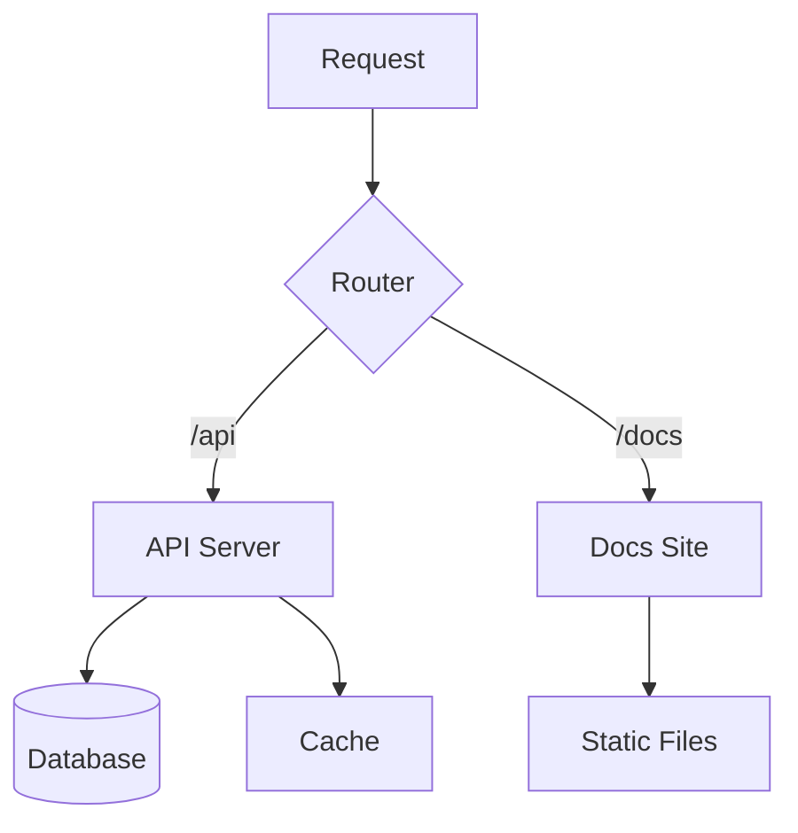
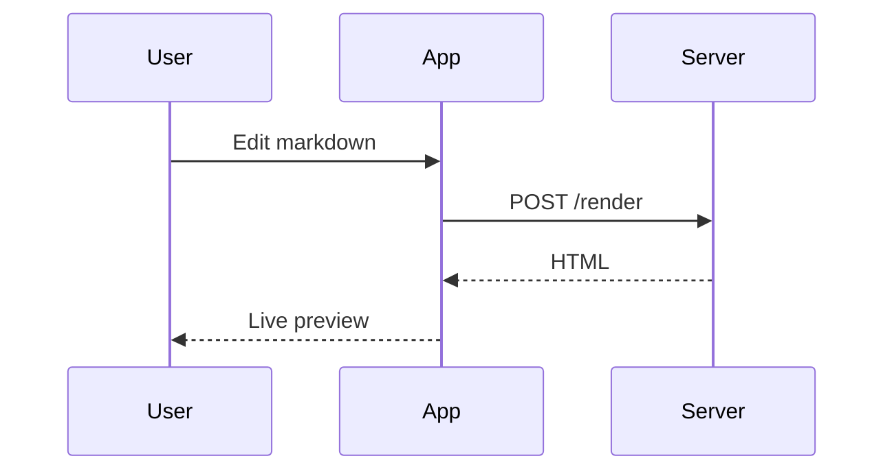
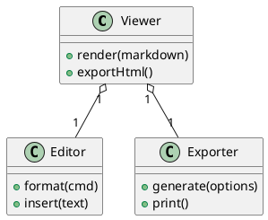
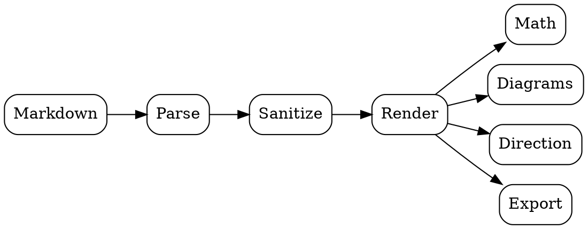

# Comprehensive Rendering Test — Exhaustive Feature Tour

> **Purpose:** this document exercises *every* feature of the Advanced Markdown Viewer, including edge cases, multi-language code, long printable blocks, multi-format diagrams and mixed-direction text. It is intentionally long enough to span several printed pages.

## Table of Contents

- [Typography & Inline](#typography--inline)
- [Alerts — All Five Types](#alerts--all-five-types)
- [Quotes — Plain & Nested](#quotes--plain--nested)
- [Lists — Every Flavor](#lists--every-flavor)
- [Tables — Wide & Long](#tables--wide--long)
- [Code — Many Languages](#code--many-languages)
- [Code — A Very Long Block](#code--a-very-long-block)
- [Mathematics — Inline & Display](#mathematics--inline--display)
- [Diagrams — Mermaid, PlantUML, GraphViz](#diagrams--mermaid-plantuml-graphviz)
- [Mixed Direction — RTL inside LTR](#mixed-direction--rtl-inside-ltr)
- [Extras — Details, Footnotes, Emoji, kbd](#extras--details-footnotes-emoji-kbd)

## Typography & Inline

This is **bold**, *italic*, ***bold italic***, ~~strikethrough~~ and ==highlighted== text.

Inline code: `npm install marked`, a [normal link](https://github.com), an [external link](https://developer.mozilla.org), keyboard keys like <kbd>Ctrl</kbd> + <kbd>S</kbd>, and abbreviations like <abbr title="HyperText Markup Language">HTML</abbr>.

Emoji shortcodes: :rocket: :tada: :bulb: :warning: :white_check_mark: :fire: :star: :heart: :100: :camel:

A long paragraph to test line wrapping and text flow behaviour. The quick brown fox jumps over the lazy dog while the renderer measures every word, wraps every line, and keeps the typography tidy across viewport widths of every size. Good typesetting is invisible — the reader should never notice the machinery underneath, only the comfort of reading itself. This paragraph intentionally repeats itself a little to occupy more than a single printed line, so that page-break rules for paragraphs have something honest to work with when the document is sent to paper.

## Alerts — All Five Types

> [!NOTE]
> This is a **note** with a single-line body. It must not have a blank first line.

> [!TIP]
> Tips help users do things faster.
> This second line must sit directly below the first — no gap.

> [!IMPORTANT]
> Important content with a list:
> - First point
> - Second point
> - Third point

> [!WARNING]
> Warnings draw attention to potential problems.
> They stay readable in both themes and both directions.

> [!CAUTION]
> Caution alerts mark destructive or risky operations.

> [!NOTE] Marker with trailing words
> The marker line may carry extra words; the renderer must strip the marker cleanly and keep the rest as body text without any leading blank line.

A paragraph right after an alert — the vertical rhythm above and below the alert must look balanced.

## Quotes — Plain & Nested

> A plain blockquote with a single paragraph.
> It spans two source lines that join into one.

> A quote with multiple paragraphs.
>
> Second paragraph inside the same quote.

> Level one
> > Level two
> > > Level three — nested quotes must stay readable.

## Lists — Every Flavor

1. Ordered item one
2. Ordered item two
   1. Nested ordered 2.1
   2. Nested ordered 2.2
3. Ordered item three

- Unordered item
- Another unordered item
  - Nested unordered
    - Deeper nested
- Back to top level

- [x] Completed task with :white_check_mark:
- [ ] Pending task one
- [ ] Pending task two
  - [x] Nested completed
  - [ ] Nested pending

1. Mixed list containing code: `const x = 1`
2. Mixed list containing **bold** and *italic*
3. Mixed list containing an emoji :tada:

## Tables — Wide & Long

| Feature | Status | Theme-aware | RTL-aware | Printable | Notes |
|---------|:------:|:-----------:|:---------:|:---------:|-------|
| Tables | ✅ | ✅ | ✅ | ✅ | Sticky-free, zebra rows |
| Alerts | ✅ | ✅ | ✅ | ✅ | Five types |
| Math | ✅ | ✅ | ✅ | ✅ | KaTeX |
| Diagrams | ✅ | ✅ | ✅ | ✅ | Mermaid + PlantUML + GraphViz |
| Export | ✅ | ✅ | ✅ | ✅ | Standalone HTML |
| PDF | ✅ | ✅ | ✅ | ✅ | Chunked code, break rules |

| # | Row | Value |
|---|-----|-------|
| 1 | alpha | 10 |
| 2 | beta | 20 |
| 3 | gamma | 30 |
| 4 | delta | 40 |
| 5 | epsilon | 50 |
| 6 | zeta | 60 |
| 7 | eta | 70 |
| 8 | theta | 80 |
| 9 | iota | 90 |
| 10 | kappa | 100 |
| 11 | lambda | 110 |
| 12 | mu | 120 |
| 13 | nu | 130 |
| 14 | xi | 140 |
| 15 | omicron | 150 |
| 16 | pi | 160 |
| 17 | rho | 170 |
| 18 | sigma | 180 |
| 19 | tau | 190 |
| 20 | upsilon | 200 |

## Code — Many Languages

SQL with a join and a window function:

```sql
SELECT
  d.department_name,
  e.first_name,
  e.last_name,
  ROUND(AVG(e.salary) OVER (PARTITION BY e.department_id), 2) AS avg_salary
FROM employees e
JOIN departments d ON d.department_id = e.department_id
WHERE e.hire_date >= DATE '2020-01-01'
ORDER BY d.department_name, avg_salary DESC;
```

JSON:

```json
{
  "name": "advanced-markdown-viewer",
  "version": "2.1.0",
  "features": ["math", "diagrams", "rtl", "alerts"],
  "nested": { "ok": true, "count": 42 }
}
```

YAML:

```yaml
server:
  host: 127.0.0.1
  port: 8437
features:
  math: true
  diagrams:
    - mermaid
    - plantuml
    - graphviz
```

Bash:

```bash
#!/usr/bin/env bash
set -euo pipefail
for file in *.md; do
  echo "Processing ${file}..."
  wc -l "${file}"
done
```

CSS:

```css
.card {
  display: grid;
  grid-template-columns: repeat(auto-fill, minmax(240px, 1fr));
  gap: 1rem;
  border-radius: 12px;
  box-shadow: 0 4px 16px rgb(0 0 0 / 10%);
}
```

Java:

```java
public final class Greeter {
    private final String name;

    public Greeter(String name) {
        this.name = name;
    }

    public String greet() {
        return "Hello, " + name + "!";
    }

    public static void main(String[] args) {
        System.out.println(new Greeter("World").greet());
    }
}
```

Go:

```go
package main

import "fmt"

func fibonacci(n int) int {
    if n <= 1 {
        return n
    }
    return fibonacci(n-1) + fibonacci(n-2)
}

func main() {
    for i := 0; i < 10; i++ {
        fmt.Println(fibonacci(i))
    }
}
```

An unknown language label (must fall back to auto-detection and keep the label):

```mytool-config
enable_cache = true
cache_size = 128
workers = [4, 8, 16]
```

## Code — A Very Long Block

The block below has more than sixty lines — when printed, it must be split into page-sized chunks, each carrying its own header and a *(continued)* marker, and no code may be lost at chunk boundaries.

```javascript
// ---- Long module: memoized dynamic programming helpers ----
const cache = new Map();

function memoize(key, compute) {
  if (cache.has(key)) {
    return cache.get(key);
  }
  const value = compute();
  cache.set(key, value);
  return value;
}

function fib(n) {
  return memoize(`fib:${n}`, () => {
    if (n <= 1) return n;
    return fib(n - 1) + fib(n - 2);
  });
}

function lucas(n) {
  return memoize(`lucas:${n}`, () => {
    if (n === 0) return 2;
    if (n === 1) return 1;
    return lucas(n - 1) + lucas(n - 2);
  });
}

function pascal(row, col) {
  return memoize(`pascal:${row}:${col}`, () => {
    if (col === 0 || col === row) return 1;
    return pascal(row - 1, col - 1) + pascal(row - 1, col);
  });
}

function partition(n, max) {
  return memoize(`part:${n}:${max}`, () => {
    if (n === 0) return 1;
    if (n < 0 || max === 0) return 0;
    return partition(n, max - 1) + partition(n - max, max);
  });
}

function collatzSteps(n) {
  let steps = 0;
  while (n !== 1) {
    n = n % 2 === 0 ? n / 2 : 3 * n + 1;
    steps++;
  }
  return steps;
}

function digitSum(n) {
  return String(n)
    .split('')
    .reduce((sum, d) => sum + Number(d), 0);
}

function isPrime(n) {
  if (n < 2) return false;
  if (n % 2 === 0) return n === 2;
  for (let i = 3; i * i <= n; i += 2) {
    if (n % i === 0) return false;
  }
  return true;
}

function primesBelow(limit) {
  const primes = [];
  for (let n = 2; n < limit; n++) {
    if (isPrime(n)) primes.push(n);
  }
  return primes;
}

function gcd(a, b) {
  return b === 0 ? a : gcd(b, a % b);
}

function lcm(a, b) {
  return (a * b) / gcd(a, b);
}

function formatTable(rows) {
  const widths = rows[0].map((_, c) =>
    Math.max(...rows.map((r) => String(r[c]).length))
  );
  return rows
    .map((r) => r.map((cell, c) => String(cell).padEnd(widths[c])).join(' | '))
    .join('\n');
}

const report = formatTable([
  ['function', 'input', 'result'],
  ['fib', '20', String(fib(20))],
  ['lucas', '20', String(lucas(20))],
  ['pascal', '10 5', String(pascal(10, 5))],
  ['partition', '30 30', String(partition(30, 30))],
  ['collatz', '27', String(collatzSteps(27))],
  ['digitSum', '12345', String(digitSum(12345))],
  ['primesBelow', '50', primesBelow(50).join(',')],
  ['lcm', '12 18', String(lcm(12, 18))]
]);

console.log(report);
```

## Mathematics — Inline & Display

Euler's identity $e^{i\pi} + 1 = 0$ sits inline, and the Gaussian integral below is display math:

$$\int_{-\infty}^{\infty} e^{-x^2} \, dx = \sqrt{\pi}$$

The quadratic formula with fractions:

$$x = \frac{-b \pm \sqrt{b^2 - 4ac}}{2a}$$

A sum and a limit on the same line: $\sum_{k=1}^{n} k = \frac{n(n+1)}{2}$ and $\lim_{x \to 0} \frac{\sin x}{x} = 1$.

## Diagrams — Mermaid, PlantUML, GraphViz

A Mermaid flowchart:



A Mermaid sequence diagram:



A PlantUML class diagram (rendered through the multi-format diagram pipeline):



A GraphViz dot graph:



## Mixed Direction — RTL inside LTR

An English paragraph, then a Persian paragraph embedded in the same English document — each block must follow its own direction:

پاراگراف فارسی برای تست جهت ترکیبی. این متن باید راست‌چین نمایش داده شود حتی وقتی سند اصلی انگلیسی است و تراز آن باید از سمت راست باشد.

Back to English. Then a Persian sentence with embedded `inline code` and a number 12345 to test bidi handling of punctuation and digits.

## Extras — Details, Footnotes, Emoji, kbd

<details>
<summary>Hidden details block — click to open</summary>

Inside the details: **bold**, `code`, and a list:

- One
- Two
- Three

</details>

This sentence has three footnotes: one here[^alpha], one here[^beta], and one referencing the first again[^alpha].

[^alpha]: The alpha footnote — it must appear once, numbered by first reference.
[^beta]: The beta footnote with **bold** and `code` inside.
[^gamma]: An unreferenced footnote — it must not appear in the output.

Press <kbd>Ctrl</kbd>+<kbd>K</kbd> to insert a link. Press <kbd>Tab</kbd> to indent.

---

**End of the comprehensive test document.** If every section above looks right — in both themes, both directions, on screen, in the exported HTML and on paper — the viewer is doing its job. :tada:
